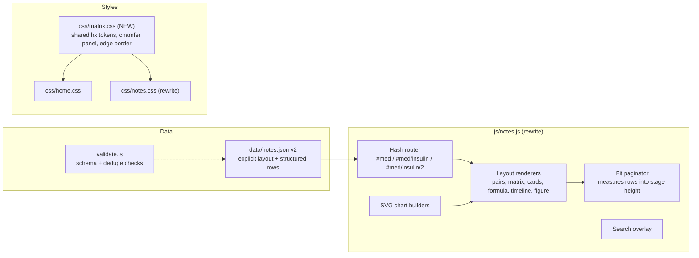

# Study Notes v3: Plan for the "Terminal Codex" Overhaul

Repo: `Desktop\PTCB26` · branch `feature/home-hud-overhaul` · last commit `ec38e8f` (Codex v2)

---

> **Superseded for working decisions by [`study_notes_v4_plan.md`](study_notes_v4_plan.md).** Keep this file for architecture detail and history.


## 1. Why v2 missed


| Problem | Evidence |
|---|---|
| **Palette is generic, not Matrix** | `notes.css` uses Tailwind *slate* (`#0e1622`, `#94a3b8`, `#38bdf8`), so it looks like a stock admin dashboard. Home uses green-black fills, chamfered panels, gradient "edge" borders, mint/green/cyan (`--hx-*` in `home.css`). The two pages share no tokens. README rubric #5 locked in the slate choice, and that rule is the real cause. |
| **Chrome eats the viewport** | About 400px of header, summary paragraph, nav bar, and topic header sit above the first data row. The nav bar appears twice. Three closed accordions and the search bar sit below the fold. The page is about 1,550px tall at 1440×900, which breaks locked rule #1 (viewport as frame). |
| **Rows waste space** | Every item becomes a 50px table row with one short line. The 32% left column is mostly empty. Short items (brand/generic, sig codes) get the same treatment as 300-character law notes. |
| **Paging only works per topic** | "Pages" = topics. A 15-row topic still scrolls, and nothing fits content to the screen. |
| **Layouts guessed from title strings** | `detectLayoutType()` matches substrings in titles. Items that miss the `: ` split fall back to `NOTE` badges (visible in the screenshot). |
| **Content noise** | About 25 duplicate or near-duplicate items: Lipitor ×2, rapid insulin ×2, SL ×2, ACE cough ×2, DEA forms 222/106/41/224 each ×2, CMEA ×4, PPPA ×2, C-II partial fill ×2, recall classes ×2, double checks ×3, USP chapters ×2, garbing ×2, and alligation ×3 even though it isn't tested. Some items sit in the wrong section (NPI and Orange Book under *Recalls*, PPE donning under *QA Reporting*, vaccine temps under *Infection Control*). |

**Takeaway:** a new skin won't fix this. The page needs **less chrome, denser and structured data, shared design tokens, and paging based on screen space.**

---

## 2. Target architecture



### 2.1 Page frame (desktop ≥ 900px, zero scroll)

```
┌──────────────── existing 3-zone header (unchanged) ─────────────────┐
├─ RAIL (≈280px) ─┬──────────────── STAGE ───────────────────────────┤
│ [MED  35% ▮▮▮▮] │ TOPIC STRIP: ‹  Insulin Types · 3/10 · pg 1/2  › │  ← one 44px line
│ [SAFE 23.75%  ] │ ┌──────────────────────────────────────────────┐ │
│ [ORDER 22.5%  ] │ │ content: tables, pair grids, cards, charts    │ │
│ [FED  18.75%  ] │ │ fit to stage height; extra goes to page 2      │ │
│ ── topics ──    │ │                                                │ │
│ › Classes&Stems │ │                                                │ │
│ › Brand↔Generic │ └──────────────────────────────────────────────┘ │
│   …             │                                                  │
│ ⌕ search (rail footer)                                             │
└─────────────────┴──────────────────────────────────────────────────┘
```

- **Rail:** 4 domain chips as chamfered pods with weight bars (same visual language as home's telemetry bars), then the active domain's topic list. Search goes in the rail footer, so it stays at the bottom (rule #8) but is visible without scrolling.
- **Domain landing ("category page"):** `#med` with no topic shows a grid of chamfered topic tiles (title, item count, layout glyph, optional emblem art). This replaces the summary paragraph and the accordions.
- **Topic page:** one topic strip (prev/next, page dots, counter) replaces both nav bars, the "TOPIC 1 OF 14" header, and the "15 Points" chip. ← / → keys page through, then move to the next topic.
- **Hash routing** (`notes.html#fed/dea-forms/2`): deep links work, the browser Back button works, and the app stays a single HTML file with no build step.
- **Mobile (< 900px):** the rail becomes a sticky domain tab row plus a topic `<select>`, and normal scrolling is allowed there.

### 2.2 Density first, paging as fallback

- The stage is about 1100×760 at 1440×900. With the multi-column layouts below, **most topics fit on one screen**. The largest topic (Key Federal Laws, 2,053 chars) fits as 2-column cards.
- **Fit paginator:** render rows into a hidden measuring container at stage width, pack them greedily into pages no taller than the stage, and re-pack on `ResizeObserver` (debounced). Rows are never split. Paging only appears on smaller screens (1366×768) or very long topics.

### 2.3 Schema-driven content (`notes.json` v2)

Each section declares its layout and stores structured rows, so the renderer no longer guesses from strings:

```json
{ "id": "insulin", "title": "Insulin Types", "layout": "matrix",
  "columns": ["Type", "Agents", "Onset", "Peak / Duration", "Notes"],
  "rows": [["Rapid", "lispro (Humalog), aspart (NovoLog), glulisine (Apidra)", "~15 min", "—", "with meals"]],
  "figure": "insulin-curve", "optional": false }
```

| Layout | Use | Look |
|---|---|---|
| `pairs` | Brand↔Generic, Sig codes, Conversions, ISMP Avoid→Use, Aux labels | Dense 3–4 column grid of `key → value` cells (about 34px each). Keys in mono green, values in ice. |
| `matrix` | Classes & Stems, Insulin, Schedules, DEA Forms, Recall classes, USP chapters, Reject/DAW codes | Real multi-column tables with columns specific to the topic. |
| `cards` | Laws, REMS, DSCSA, Immunization workflow, Dosage forms | 2–3 column chamfered pods: tag, body, optional icon. |
| `formula` | Calculations | Formula in mono, a one-line meaning, a worked example. |
| `timeline` | Federal laws 1938→2023, C-II partial-fill clocks (72h / 30d / 60d), DUR (pro / concurrent / retro) | Horizontal SVG or CSS track. |
| `figure` | NDC anatomy, DEA check-digit, MERP A–I ladder, storage temps, PPE sequence, waste bins | Inline SVG built in code, or a Google AI image with HTML labels on top. |

`splitOutsideParens` stays as a helper for inline chips. Rubric #6 still applies.

**Semantic inline marks** in the data: `!!do NOT crush!!` → amber warning, `^^CI^^` → pink contraindication, `` `-pril` `` → green stem chip. This gives each color a meaning instead of using color for decoration.

### 2.4 Proposed topic map (dedupe and re-home, about 44 → 34 topics)

| Domain | Topics (layout) |
|---|---|
| **Medications** (14→11) | Classes & Stems + MOA merged (matrix: Class, Stem, Examples, MOA, Pearl) · Brand↔Generic, adding brands already named elsewhere in the notes (pairs) · OTC Actives (matrix) · Insulin (matrix + curve) · High-Alert & LASA (chip list + tall-man pair grid) · Side Effects & Monitoring (matrix) · Interactions & CIs (`A + B → result` pairs) · Dosage Forms & Routes (cards + specimen art) · Storage: vaccines + insulin (temperature-band figure) · Pregnancy & Teratogens (cards) · MSK/Gout (matrix) · NTI → collapsed "Archive" toggle |
| **Patient Safety** (10→8) | Error Prevention & Double Checks · ISMP Avoid→Use (pairs) · NDC (figure) · Error Types & DUR (timeline) · Reporting & MERP (A–I ladder figure) · QI Methods RCA/FMEA/PDSA (cards) · Infection Control & HD (PPE sequence figure) · USP Chapters (matrix: chapter, scope, 2026 status) · Immunization Workflow |
| **Order Entry** (9→7) | Sig Codes (pairs, every token split out) · Conversions (pairs + temp formula) · Calculations, Core + Essential merged (formula; alligation in Archive) · Reading & Intake merged · Refills (matrix + partial-fill timeline) · Insurance (BIN/PCN pairs, DAW + reject matrices) · Aux Labels (pairs) |
| **Federal** (11→9) | Schedules (matrix: schedule, abuse, examples, refills) · DEA Forms (matrix: form, purpose, deadline; 10 rows → 6) · Waste & OSHA (waste-bin figure + P/U matrix) · Laws Timeline (Key Laws + Counseling/Omnibus merged) · CS Records, Transfers & Partial Fills · HIPAA · PPPA & Packaging · REMS & CMEA (CMEA kept once) · DEA Number (figure + a small live check-digit validator) · Recalls & DSCSA (Orange Book / NPI / "stricter rule" moved to Laws) |

> [!IMPORTANT]
> **Content flags for your review.** I won't change facts without your OK:
> 1. Med › Side Effects: `"Amiodarone/pioglitazone: pioglitazone → HF…"` is mislabeled; amiodarone has no content.
> 2. Med › Resp/Psych: SSRI stems `(-oxetine/-sertraline)` are wrong. Duloxetine (an SNRI) is also "-oxetine", and sertraline isn't a stem.
> 3. Vaccine Storage: "MMR … FROZEN". M-M-R II may be refrigerated *or* frozen; varicella must be frozen.
> 4. HIPAA penalties `$100–$50,000/violation` are probably out of date (amounts are inflation-adjusted).
> 5. An insulin curve chart needs peak/duration values for every row. Only partial values exist now. I'll show only data you approve.

### 2.5 Palette: "phosphor on obsidian-green" (replaces slate)

These are built from home's `--hx-*` tokens and moved into the new shared `css/matrix.css`:

| Role | Token | Value | Use |
|---|---|---|---|
| Background | `--mx-void` | `#010804` | Page (same as home) |
| Surface 1/2/3 | `--mx-fill-1..3` | `#04130a` / `#072014` / `#0b2c1b` | Stage, panels, table header |
| Edge | `--mx-edge` | home's green→cyan gradient | Chamfered panel borders (home `--edge`) |
| Body text | `--mx-ice` | `#e6fff0` | Reading text, about 16:1 on fill-1 |
| Secondary text | `--mx-dim` | `#9cc9a9` | Meta, column heads |
| Keys / stems | `--mx-green` | `#00ff41` | Terms, stems, active state (small amounts only) |
| Headings | `--mx-mint` | `#b6ffc9` | Topic titles |
| Values / numbers | `--mx-cyan` | `#05d9e8` | Doses, codes, ratios |
| Warning | `--mx-amber` | `#ffb000` | "do NOT", black box, deadlines |
| Danger | `--mx-pink` | `#ff2a6d` | Contraindications, fatal errors |

Type: Chakra Petch for headings and keys, JetBrains Mono for codes and numbers, and a proportional sans at 15–16px for body text. Background Matrix rain stays on and dims behind the stage (about 0.25 opacity) so it's atmospheric without hurting legibility.

---

## 3. Execution steps

| # | Step | Files |
|---|---|---|
| 0 | Branch `feature/notes-v3`. Take baseline screenshots at 1440×900, 1366×768, 1920×1080, 390×844. | — |
| 1 | **Shared tokens:** extract `--hx-*`, chamfer, and edge primitives into `css/matrix.css`. Point `home.css` at it with no visual change, and verify home pixel parity. Closes the TODO "reusable UI component library" item. | `css/matrix.css`, `css/home.css`, `index.html` |
| 2 | **Content v2:** migrate `notes.json` to the schema, dedupe and re-home per §2.4, apply the flags you approve. Extend `validate.js` with layout enum, column/row arity, unique ids, and a duplicate-text check. | `data/notes.json`, `validate.js` |
| 3 | **Shell:** rewrite the `notes.html` main area as a rail + stage grid. Header unchanged. Move search into the rail footer. | `notes.html` |
| 4 | **Runtime:** hash router and state, 6 renderers, fit paginator, keyboard nav, search overlay (results listed in the stage, click jumps to topic/page), inline-mark parser. | `js/notes.js` |
| 5 | **charts in code:** SVG builders for NDC, DEA check digit, MERP ladder, storage temps, PPE sequence, partial-fill clocks, DUR, laws timeline. Text stays as real text for accuracy and search. | `js/notes.js` (or `js/notes-figures.js`) |
| 6 | **Styles:** rewrite `notes.css` on `matrix.css` tokens. Responsive breakpoint at 900px. | `css/notes.css` |
| 7 | **Art (optional):** add Google AI images to `assets/notes/` and convert to WebP. Image slots fall back to SVG glyphs, so the build doesn't depend on art. | `assets/notes/*` |
| 8 | **Verify:** no vertical scroll at ≥1366×768; every topic reachable by rail, keys, and deep link; search hits jump correctly; Back button works; screenshots compared against baseline; `node validate.js`. Node isn't currently on PATH, so it needs installing or the check runs elsewhere. | — |
| 9 | **Docs + cache:** rewrite README rubric #5 (palette) and #7 (layouts), note the search change in #8, bump `sw.js` to `ptce-2026-v44` and `?v=44`, update TODO. | `README.md`, `TODO.md`, `sw.js` |

---

## 4. Google AI image briefs (optional, small set)

Image models tend to garble text, so **charts and labeled diagrams will be built in code (step 5).** Use Google AI only for **text-free art**; I'll put real HTML labels on top.

**Format for all images:** PNG, **pure black `#000000` background** (I'll blend it with `mix-blend-mode: screen`, so black disappears on the dark UI), **no text, letters, numbers, or logos**. Palette: phosphor green `#00ff41`, mint `#b6ffc9`, cyan `#05d9e8`, with amber `#ffb000` only where noted. Style: *glowing wireframe hologram, Matrix-movie terminal aesthetic, thin luminous lines, subtle scanlines, centered subject, generous empty margin.*

### Priority 1

**A. Domain emblems (4 images)** for the rail chips and domain landing tiles. Generate 1024×1024 square; shown at 64px (rail) and about 180px (landing).
| File | Subject |
|---|---|
| `emblem-medications.png` | Two capsules and a round tablet floating, wireframe hologram, slow orbit lines |
| `emblem-safety.png` | Shield with a checkmark formed from circuit traces |
| `emblem-order-entry.png` | Prescription pad / clipboard as a holographic terminal screen with blank lines (no writing) |
| `emblem-federal.png` | Balance scale / gavel built from green wireframe, faint grid floor |

Prompt template: *"[Subject], glowing green wireframe hologram, Matrix film aesthetic, pure black background, no text, centered, thin luminous #00ff41 and #b6ffc9 lines with faint #05d9e8 highlights, 1:1, minimal, high contrast, empty margin around subject."*

**B. Pharmaceutical waste containers (1 image):** `waste-bins.png`, generate 1600×900 (16:9), shown at about 720×405 in the Waste & OSHA topic.
Four lidded pharmacy waste containers side by side, evenly spaced and the same size, in this exact left-to-right order: **black, yellow, red, blue**. The red one is a sharps container with a slotted lid. Semi-realistic with a soft rim glow, pure black background, **no labels, symbols, or text on the bins**, and space under each bin for a caption I'll add.

### Priority 2 (nice to have)

**C. Dosage-form specimens (8 images)** for Dosage Forms cards. Generate 512×512, shown at about 72px. Hologram style as above, one object per image:
`form-sublingual.png` (small tablet under a stylized tongue outline) · `form-enteric.png` (coated tablet with a visible outer shell layer) · `form-er.png` (tablet with layered bands) · `form-odt.png` (tablet dissolving into particles) · `form-patch.png` (square transdermal patch) · `form-suppository.png` (bullet-shaped suppository) · `form-inhaler.png` (metered-dose inhaler) · `form-suspension.png` (bottle with settled particles and a shake-motion arc).

> [!TIP]
> Put finished files in `Desktop\PTCB26\assets\notes\` with the names above. I'll handle WebP conversion, sizing, and blending. If any image comes back with text in it, regenerate, or skip it. Every slot has a code-drawn fallback.

---

## 5. Decisions needed before I start

1. **Rubric changes:** OK to replace locked rubric #5 (slate palette) with the phosphor palette in §2.5, and move search to the rail footer (still bottom, but visible)?
2. **Content edits:** OK to dedupe and re-home per §2.4? Which of the 5 flags should I fix?
3. **Workflow:** README says code goes through Cursor cloud agents and PRs. Should I implement directly on a local `feature/notes-v3` branch and leave merging to you?
4. **Scope:** Notes only for now, or should Course and Exam adopt `matrix.css` in a later pass?
